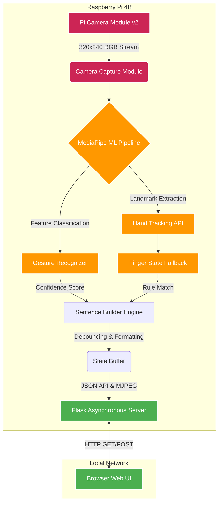
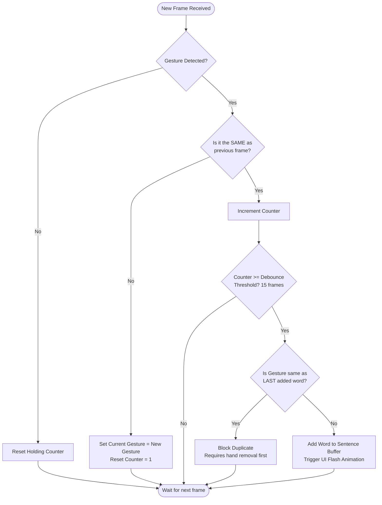
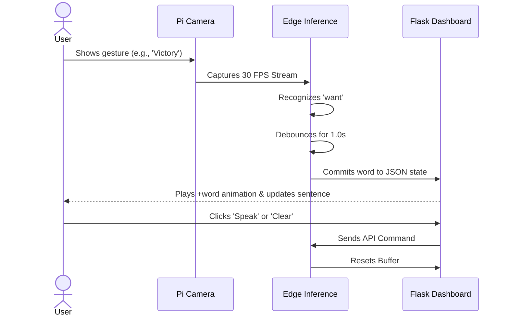

<div align="center">
  
# 🤖 Real-Time Hand Gesture to Sentence System

[](https://www.python.org/downloads/release/python-390/)
[](https://mediapipe.dev/)
[](https://flask.palletsprojects.com/)
[](https://www.raspberrypi.org/)

*An edge-computing AI system that translates sign language and hand gestures into meaningful, coherent sentences in real-time, built specifically for the Raspberry Pi 4.*

</div>

---

## 💡 About the Project

This project bridges the communication gap by translating real-time hand gestures into text sentences. Rather than relying on cloud APIs, all inference happens **on-edge** using a Raspberry Pi 4 Model B. 

By leveraging Google's MediaPipe framework for spatial hand tracking and a custom debounce-buffering algorithm, the system achieves **real-time, zero-latency translation** directly on constrained hardware.

### 🌟 Key Features
- **Real-Time Edge Inference:** Runs entirely on the Raspberry Pi 4 without cloud dependency.
- **Pre-Trained AI Models:** Utilizes Google's state-of-the-art MediaPipe Gesture Recognizer.
- **Intelligent Sentence Building:** Custom debouncing logic prevents double-registrations and builds grammatically sensible outputs.
- **Zero-Setup Web UI:** A beautiful, responsive dark-glassmorphic Flask web interface streams the processed camera feed and UI data directly to any device on the local network.
- **Hybrid Classifier Architecture:** Primary ML task API with a seamless fallback to a mathematical rule-based finger-state classifier.

---

## 🏗️ System Architecture

The system is designed with a decoupled architecture, separating the ML pipeline from the web streaming service to maximize FPS on the Raspberry Pi.



### 🧠 Sentence Builder Logic (Debouncing Algorithm)
To prevent noisy, fluttering frame predictions from inserting duplicate words, we use a robust debouncing algorithm. A gesture must be held consistently for a threshold of frames before it is committed.



### 🎮 User Interaction Flow



---

## 🛠️ Tech Stack

- **Core Logic:** Python 3.9+
- **Computer Vision:** OpenCV (`cv2`) for frame manipulation and HUD overlays.
- **Machine Learning:** Google MediaPipe (Spatial tracking & classification).
- **Web Backend:** Flask (Asynchronous threading for MJPEG streaming).
- **Frontend UI:** Pure HTML/CSS/JS with custom animations (No heavy frameworks to ensure maximum client performance).

---

## ✋ Supported Gestures

The system maps specific spatial hand coordinates to words. By combining them, users can build full sentences.

| Gesture / Hand Shape | Detected Class | Mapped Word |
|----------------------|----------------|-------------|
| ☝️ Index Finger Up    | `Pointing_Up`  | **I**       |
| ✌️ Peace Sign         | `Victory`      | **want**    |
| 🖐️ Open Palm          | `Open_Palm`    | **hello**   |
| ✊ Closed Fist        | `Closed_Fist`  | **no**      |
| 👍 Thumbs Up          | `Thumb_Up`     | **yes**     |
| 🤟 Sign of the Horns  | `ILoveYou`     | **love**    |
| 👎 Thumbs Down        | `Thumb_Down`   | **stop**    |

---

## 🚀 Installation & Deployment

### Hardware Requirements
- **Raspberry Pi 4 Model B** (2GB RAM or higher)
- **Raspberry Pi Camera Module v2** (or standard USB Webcam)
- **64-bit Raspberry Pi OS** (Required for MediaPipe ARM64 binaries)

### Quick Start Setup

1. **Clone the repository:**
   ```bash
   git clone https://github.com/harshgupta170704/raspberry-pi-gesture-system.git
   cd raspberry-pi-gesture-system
   ```

2. **Run the automated deployment script:**
   *This script handles system dependencies (OpenCV, libcamera), creates a virtual environment, and downloads the pre-trained ML models.*
   ```bash
   chmod +x setup.sh
   ./setup.sh
   ```

3. **Start the Engine:**
   ```bash
   source venv/bin/activate
   python main.py
   ```

4. **Access the Web Dashboard:**
   Open any web browser on the same network and navigate to:
   ```
   http://<YOUR_RASPBERRY_PI_IP>:5000
   ```

---

## ⚙️ Configuration

The system is highly tunable for different hardware setups. Modify `config.py` to adjust performance thresholds:

```python
# Optimize for edge processing
CAMERA_WIDTH = 640
CAMERA_HEIGHT = 480
CAMERA_FPS = 30

# Debounce logic (prevent double-typing words)
DEBOUNCE_FRAMES = 15     # Hold gesture for ~1 second to register
COOLDOWN_FRAMES = 10     # Delay before next word can be added
```

---

## 🔮 Future Roadmap

- [ ] **Custom Model Training:** Implement transfer learning to allow users to train their own custom vocabularies using `gesture_trainer.py`.
- [ ] **Dynamic Grammar Correction:** Integrate a lightweight NLP model (like a quantized T5) to automatically fix sentence grammar (e.g., "I want hello" -> "I want to say hello").
- [ ] **Text-to-Speech (TTS):** Re-integrate `pyttsx3` for localized vocalization of the completed sentences.

---

<div align="center">
  <i>Developed with ❤️ by Harsh Gupta</i>
</div>
