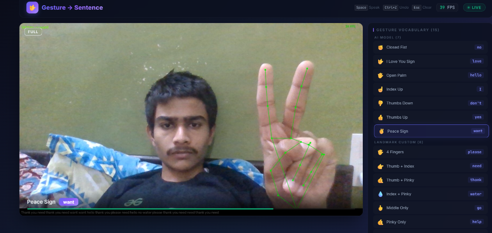
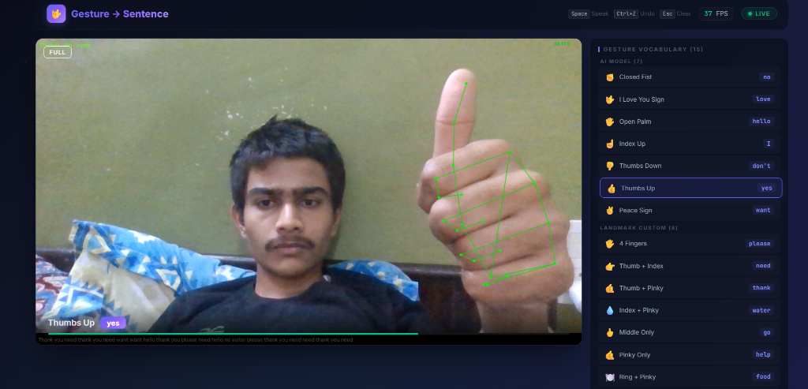
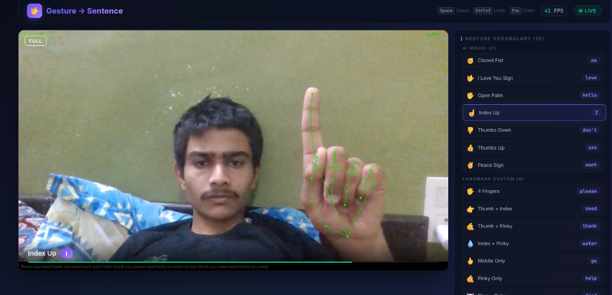
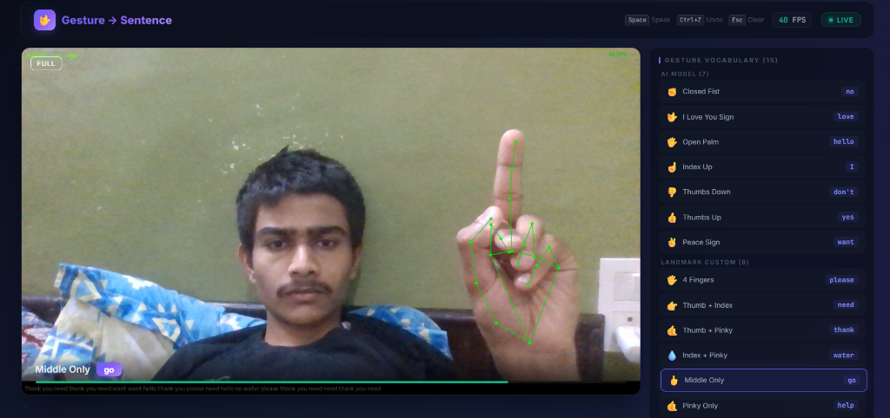
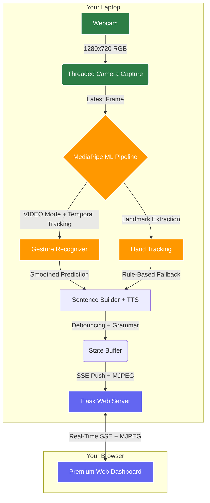
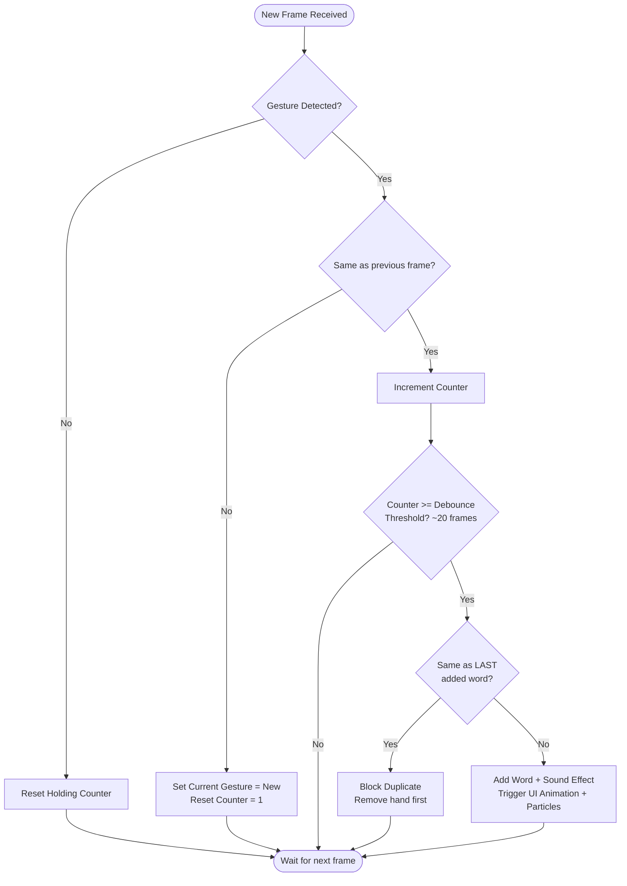

<div align="center">
  
# 🤟 Real-Time Hand Gesture to Sentence System

[](https://www.python.org/downloads/release/python-390/)
[](https://mediapipe.dev/)
[](https://flask.palletsprojects.com/)
[]()

*An AI system that translates hand gestures into meaningful sentences in real-time using your laptop's webcam. Powered by Google's free pre-trained MediaPipe Gesture Recognizer model.*

</div>

---

## 📸 Screenshots / Demo

<div align="center">
  
  <br/>
  <i>Recognizing the "Peace Sign" gesture mapped to the word "want"</i>
</div>
<br/>
<div align="center">
  
  <br/>
  <i>Recognizing the "Thumbs Up" gesture mapped to the word "yes"</i>
</div>
<br/>
<div align="center">
  
  <br/>
  <i>Recognizing the "Index Up" gesture mapped to the word "I"</i>
</div>
<br/>
<div align="center">
  
  <br/>
  <i>Recognizing the custom "Middle Only" gesture mapped to the word "go"</i>
</div>

---

---

## 💡 About the Project

This project translates real-time hand gestures into text sentences using your laptop's built-in webcam. All inference happens **locally** — no cloud APIs, no internet required during use.

Using Google's pre-trained MediaPipe Gesture Recognizer (free, open-source), the system recognizes 7 distinct hand gestures and maps them to words. A debouncing algorithm ensures stable, intentional word registration.

### 🌟 Key Features
- **Real-Time Local Inference:** Runs entirely on your laptop — no cloud dependency.
- **Pre-Trained AI Model:** Google's state-of-the-art MediaPipe Gesture Recognizer (free download).
- **VIDEO Mode Processing:** Temporal tracking between frames for smoother, faster detection.
- **Gesture Smoothing:** Rolling buffer eliminates single-frame noise for rock-solid predictions.
- **Threaded Camera Capture:** Background thread ensures camera I/O never blocks the ML pipeline.
- **Text-to-Speech:** Speak completed sentences aloud (offline via pyttsx3).
- **Premium Web UI:** Dark glassmorphic design with particle effects, sound feedback, keyboard shortcuts.
- **SSE Real-Time Updates:** Server-Sent Events push state changes instantly (no polling lag).
- **Hybrid Classifier:** ML task API with seamless fallback to rule-based finger-state classifier.

---

## 🏗️ System Architecture



### 🧠 Sentence Builder Logic (Debouncing Algorithm)



---

## ✋ Supported Gestures

| Gesture / Hand Shape | Detected Class | Mapped Word |
|----------------------|----------------|-------------|
| ☝️ Index Finger Up    | `Pointing_Up`  | **I**       |
| ✌️ Peace Sign         | `Victory`      | **want**    |
| 🖐️ Open Palm          | `Open_Palm`    | **hello**   |
| ✊ Closed Fist        | `Closed_Fist`  | **no**      |
| 👍 Thumbs Up          | `Thumb_Up`     | **yes**     |
| 🤟 Sign of the Horns  | `ILoveYou`     | **love**    |
| 👎 Thumbs Down        | `Thumb_Down`   | **stop**    |

---

## 🛠️ Tech Stack

- **Core Logic:** Python 3.9+
- **Computer Vision:** OpenCV (`cv2`) for frame manipulation and HUD overlays.
- **Machine Learning:** Google MediaPipe Gesture Recognizer (VIDEO mode with temporal tracking).
- **Text-to-Speech:** pyttsx3 (offline, no API key needed).
- **Web Backend:** Flask (threaded MJPEG streaming + SSE push).
- **Frontend UI:** Pure HTML/CSS/JS with particle effects, Web Audio API, keyboard shortcuts.

---

## 🚀 Installation & Setup

### Requirements
- **Python 3.9+**
- **Laptop with a webcam** (built-in or USB)
- **Windows / macOS / Linux**

### Quick Start

1. **Clone the repository:**
   ```bash
   git clone https://github.com/harshgupta170704/Real-Time-Hand-Gesture-to-Sentence-System.git
   cd Real-Time-Hand-Gesture-to-Sentence-System
   ```

2. **Install dependencies:**
   ```bash
   pip install -r requirements.txt
   ```

3. **Download the pre-trained model (~10 MB):**
   ```bash
   python download_model.py
   ```

4. **Start the system:**
   ```bash
   python main.py
   ```

5. **Open your browser:**
   ```
   http://localhost:5000
   ```

### ⌨️ Keyboard Shortcuts

| Key | Action |
|-----|--------|
| `Space` | Speak the current sentence |
| `Ctrl+Z` | Undo last word |
| `Esc` | Clear sentence |

### CLI Options

```bash
python main.py                       # Default: webcam + MediaPipe model
python main.py --camera picamera     # Use Pi Camera v2
python main.py --classifier rule     # Use rule-based classifier (no model needed)
python main.py --no-tts              # Disable text-to-speech
python main.py --port 8080           # Custom web server port
```

---

## ⚙️ Configuration

Modify `config.py` to fine-tune performance:

```python
# Camera
CAMERA_WIDTH = 1280        # Resolution (higher = better detection)
CAMERA_HEIGHT = 720
CAMERA_MIRROR = True       # Mirror for natural selfie view

# Detection tuning
DEBOUNCE_FRAMES = 20       # Hold gesture for ~0.7s to register
COOLDOWN_FRAMES = 8        # Delay before next word

# Gesture smoothing
SMOOTHING_WINDOW = 5       # Recent frames to consider
SMOOTHING_THRESHOLD = 0.6  # Fraction that must agree

# Text-to-Speech
TTS_ENABLED = True
TTS_RATE = 150             # Words per minute
```


## ⚡ Features Roadmap

- [ ] **Custom Model Training:** Transfer learning for custom gesture vocabularies.
- [ ] **Dynamic Grammar Correction:** Lightweight NLP to fix sentence grammar.
- [ ] **Two-Hand Mode:** Track both hands for expanded vocabulary.
- [ ] **WebSocket Upgrade:** Even lower latency state updates.

---

<div align="center">
  <i>Developed with ❤️ by Harsh Gupta</i>
</div>
